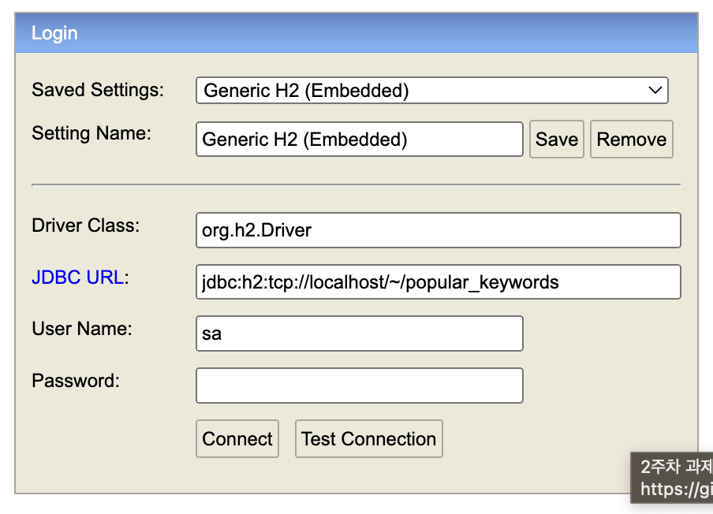

# 블로그 검색 서비스 API

## 기술스택
  - JAVA 17, Gradle 기반 Spring Boot 3.0.4
  - H2 DB 2.1.214
  - Spring Data JPA
  - JUnit5
  - Swagger
<br/>

## 기능 요구사항
1. 블로그 검색
    - 키워드를 통해 블로그를 검색할 수 있어야 합니다.
    - 검색 결과에서 Sorting(정확도순, 최신순) 기능을 지원해야 합니다.
    - 검색 결과는 Pagination 형태로 제공해야 합니다.
    - 검색 소스는 카카오 API의 키워드로 블로그 검색(https://developers.kakao.com/docs/latest/ko/daum-search/dev-guide#search-blog)을 활용합니다.
    - 추후 카카오 API 이외에 새로운 검색 소스가 추가될 수 있음을 고려해야 합니다.

2. 인기 검색어 목록
    - 사용자들이 많이 검색한 순서대로, 최대 10개의 검색 키워드를 제공합니다.
    - 검색어 별로 검색된 횟수도 함께 표기해 주세요.
<br/>

## 추가 구현사항
1. 트래픽이 많고, 저장되어 있는 데이터가 많음을 염두에 둔 구현
    - 처리율 제한을 위한 Bucket4j
2. 동시성 이슈가 발생할 수 있는 부분을 염두에 둔 구현 (예시. 키워드 별로 검색된 횟수의 정확도)
    - 비관적 락 사용(Pessimistic lock)
3. 카카오 블로그 검색 API에 장애가 발생한 경우, 네이버 블로그 검색 API를 통해 데이터 제공
    - WebClient 사용 중 5xx Server error 발생 시, 네이버 블로그 검색 API로 우회 사용하도록 구현
4. Swagger 사용
    - http://localhost:8080/swagger-ui/index.html 으로 접속하여 테스트할 수 있도록 구현
<br/>

## 실행방법
- 하기 명령어로 jar파일을 실행합니다.
```
java -jar -Dspring.profiles.active=local blogsearch.jar
```
- http://localhost:8080/h2-console 로 접속이 안되는 경우, ~ 경로에 popular_keywords.mv.db 파일을 직접 생성해줍니다.
```
cd ~
touch popular_keywords.mv.db
```

<br/>

- 아래 1개 테이블이 생성되어야 합니다.


- Swagger로 접속하여 테스트하면 됩니다. 프로젝트 실행 후 [http://localhost:8000/docs/index.html](http://localhost:8080/swagger-ui/index.html) 에서 API를 확인합니다.
